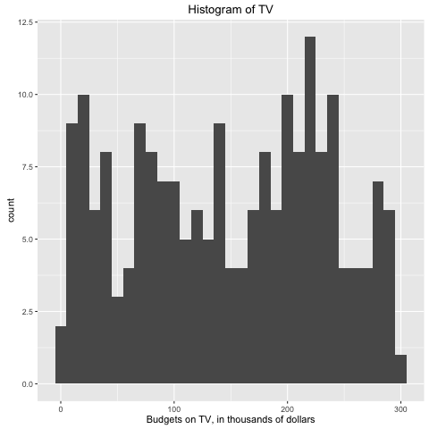

# Abstract

In this analysis, I explore the statistical relationship between advertising budget and its effectiveness. In particular, I focus on the linear relationship between the increase in the budgets spending on TV advertisement and the increase in the number of items sold by reproducing the results from the book An Introduction to Statistical Learning. 

# Introduction

Nowadays, data analytics is often utilized in business sectors to effetively predict or forecast sales and earnings. In this analysis, I closely look at the relationship between advertising and sales, and implement a simple regression model to predict sales from budget spending on TV advertisement. Over the course of analysis, I first reproduce the results from the book An Introduction to Statistical Learning. 

# Data

The advertising data set contains sales (in thousands of units) data as well as advertising budgets (in thousands of dollars) of a certain product in 200 different markets. There are three predictors namely TV, Radio and Newspaper as well as one response variable, Sales. All of the predictors are numerical values.

```{r, results='asis', echo=FALSE, message=FALSE}
library(xtable)
library(dplyr)
library(png)

data = read.csv("../data/Advertising.csv")
print(xtable(summary(select(data, -V1)), caption = 'Advertising data set'), comment = FALSE, caption.placement = 'top')

```

Table 1 shows the summary of the data set. The budget spending on TV is the highest on average. This intuitively makes sense because TV advertisement is often very expensive. Also, Newspaper seems to have a highly variance. So, it might be worth investigating what budget spending on newspaper has the high variance. However, in this analysis, I will mainly focus on TV and Sales columns.

# Methodology

In order to investigate the linear relationship between TV and Sales, I use a simple linear regression. It is a very straightforward approach and commonly used model for predicting a quantitative response Y on the basis of a single predictor variable X. It assumes that there is approximately a linear relationship between preditor and target variable. Mathematically, we can write this linear relationship as

In the context of this analysis, X represents TV advertising and Y represents sales. By fitting the model, I can regress sales onto TV, 

Before fitting the model, I first look at the general distributions of both TV and Sales. 




# Results

# Conclusions

