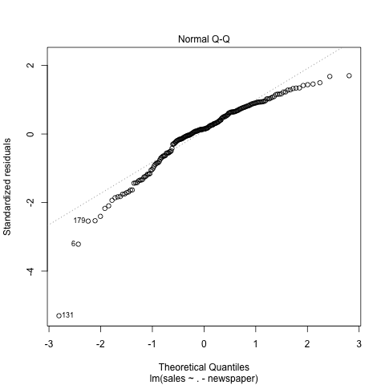
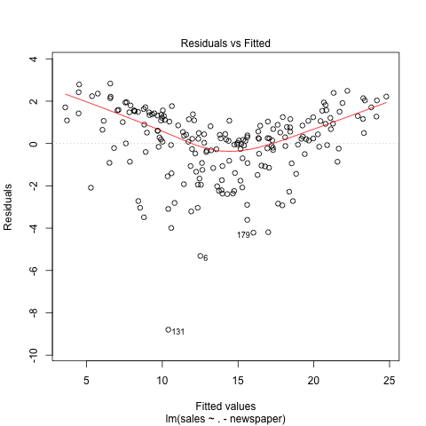

# Abstract

In this analysis, I explore the statistical relationship between advertising budget and its effectiveness. In particular, I focus on the linear relationship between the increase in three predictors, namely, TV, radio and newspapers and the increase in the number of items sold by reproducing the results from the book, An Introduction to Statistical Learning. 

# Introduction

Nowadays, data analytics is often utilized in business sectors to effetively predict or forecast sales and earnings. In this analysis, I closely look at the relationship between advertising and sales, and implement a simple regression model to predict sales from budget spending on TV advertisement. Over the course of analysis, I first reproduce the results from the book An Introduction to Statistical Learning. 

# Data

The advertising data set contains sales (in thousands of units) data as well as advertising budgets (in thousands of dollars) of a certain product in 200 different markets. There are three predictors namely TV, Radio and Newspaper as well as one response variable, Sales. All of the predictors are numerical values.

```{r, results='asis', echo=FALSE, message=FALSE, include=FALSE}
library(xtable)
library(dplyr)
library(png)
library(grid)

# Load data into report
load("../data/regression.RData")
load("../data/correlation-matrix.RData")

# load data
data = read.csv("../data/Advertising.csv")
data.rdata = load("../data/regression.RData")
print(xtable(summary(data), caption = 'Advertising data set'), comment = FALSE, caption.placement = 'top')

```

Table 1 shows the summary of the data set. The budget spending on TV is the highest on average. This intuitively makes sense because TV advertisement is often very expensive. Also, Newspaper seems to have a highly variance. So, it might be worth investigating what budget spending on newspaper has the high variance. However, in this analysis, I will mainly focus on TV and Sales columns.

# Methodology

In order to investigate the linear relationship between multiple predictors (TV, radio and newspaper) and Sales, I use a multiple linear regression. It is a very straightforward approach and commonly used model for predicting a quantitative response Y on the basis of multiple predictors variables. It assumes that there is approximately a linear relationship between preditors and target variable. Mathematically, we can write this multiple linear relationship as $$Sales = \beta_{0} + \beta_{1} TV + \beta_{2} Radio + \beta_{3} Newspaper $$
$\beta_0$ indicates the intercept and $\beta_1$ to $\beta_3$ indicate the slopes for the multiple linear model. The objective is to estimate the coefficients by minimizing the least squares with the formula above.

# Results

Here are statistics about the simple linear regressions on TV, radio and newspapers.

#### Linear Regression on TV vs Sales

```{r, results='asis', echo=FALSE, message=FALSE}
advertising = read.csv("../data/Advertising.csv", header = TRUE)
lm <- lm(Sales ~ TV, data = advertising)
lm.summary <- summary(lm)
print(xtable(lm.summary$coefficient, caption = 'Linear Regression on TV vs Sales'), comment = FALSE, caption.placement = 'top')
cat("\n")
```

Table 1 shows the linear regression on TV vs Sales. The estimated slope is 0.05 and it is statistically significant given the p-value.

#### Linear Regression on Radio vs Sales

```{r, results='asis', echo=FALSE, message=FALSE}

lm <- lm(Sales ~ Radio, data = advertising)
lm.summary <- summary(lm)
print(xtable(lm.summary$coefficient, caption = 'Linear Regression on Radio vs Sales'), comment = FALSE, caption.placement = 'top')
cat("\n")
```

Table 2 shows the linear regression on radio vs Sales. The estimated slope is 0.2 and it is statistically significant given the p-value, and it is stiffer than TV. It might be the case that the radio is more important factor than TV.

#### Simple Linear Regression on Newspaper and Sales

```{r, results='asis', echo=FALSE, message=FALSE}
lm <- lm(Sales ~ Newspaper, data = advertising)
lm.summary <- summary(lm)
print(xtable(lm.summary$coefficient, caption = 'Linear Regression on Newspaper vs Sales'), comment = FALSE, caption.placement = 'top')
cat("\n")
```

Table 3 shows the linear regression on newspaper vs Sales. The estimated slope is 0.05 and it is statistically significant given the p-value and it is similar to the estimated slope from TV 

#### Regression Coefficients

```{r, results='asis', echo=FALSE, message=FALSE}

print(xtable(advertising.model.summary$coefficient, caption = 'Multiple Linear Regression Coefficients'), comment = FALSE, caption.placement = 'top')
source('../code/functions/regression-functions.R')
print(xtable(matrix_corr, caption = 'Correlations Matrix'), comment = FALSE, caption.placement = 'top')

RSE = residual_std_error(advertising.model)
R_square = r_squared(advertising.model)
f_statistic = f_statistic(advertising.model)

df = data.frame(Quantity= c("Residual Standard Error", "R-squared", "F-statistic"), Value = c(RSE, R_square, f_statistic))
print(xtable(df, caption = 'Regression Quality Indices'), comment = FALSE, caption.placement = 'top')
```







Lastly, I fit a multiple linear regression on all of the predictors so that I can take all predictors into account. The coefficients of all the predictors in Table 4 are somewhat different from those from an individual, simple regression from Table 1, 2 and 3. This is because I consider several predictors at the same time, which is the combined linear relationship between all predictors and the target variable. Thus, it is different from a simple model which accounts for the relationship between a single predictor and a target variable. Also, as shown in Table 5, the correlation between newspaper and radio is quite high (0.35), so the model suffers from multilinearity. From Table 4, TV and Radio have p-value very close to 0, which indicates the statistical significance of predictors. Therefore, these two variables can be useful. On the other hand, Newspaper variable has p-value 0.86, which indicates that it is not statistically significant. However, if the prediction accuracy is only my concern, then I would look at adjusted R-squared with different combinations of variables. Adjusted R-squared with all predictors (TV, newspaper, radio) gives 0.8956 and the model without newspaper gives 0.8962. This means that even if I remove newspaper from the model, it does not harm the model's accuracy and rather removing it improves accuracy. From Figure 2 (Normal Q-Q plot), the data points are not on the dotted line, which means that it doesn't really meet the gaussian assumption. Also, figure 3, there is a quadratic pattern in the residual plot, which means that I can improve the model by adding a square term in the model. However, given the adjusted R-squared of 0.8962, the model fits the data quite well.

# Conclusions
In this analysis, I explore advertising data set focusing on the relationship between ththeree predictors(TV, radio, newspaper) and Sales. To start with, I reproduce the results from the book Introduction to Statistical Learning. The noteworhty result from this analysis is that when we investigate the model with a sigle variable, it seems like each of them is statistically significant with very small p-value. However, when I fit the multiple linear regression with all predictors, newspaper does not help the model improve its prediction accuracy. This is because the combined relationship between all predictors and the target variable is different from the relationship captured from a simple model with one variable. This is shown from Table 4 that p-value for radio is very high.