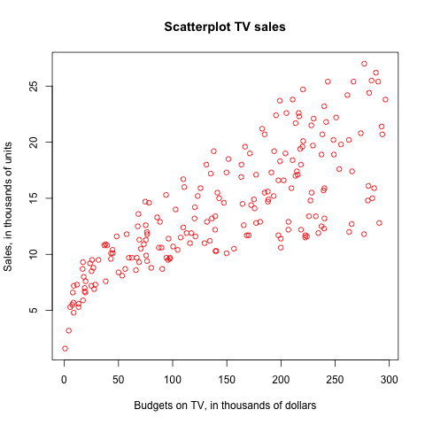

# Abstract

In this analysis, I explore the statistical relationship between advertising budget and its effectiveness. In particular, I focus on the linear relationship between the increase in the budgets spending on TV advertisement and the increase in the number of items sold by reproducing the results from the book An Introduction to Statistical Learning. 

# Introduction

Nowadays, data analytics is often utilized in business sectors to effetively predict or forecast sales and earnings. In this analysis, I closely look at the relationship between advertising and sales, and implement a simple regression model to predict sales from budget spending on TV advertisement. Over the course of analysis, I first reproduce the results from the book An Introduction to Statistical Learning. 

# Data

The advertising data set contains sales (in thousands of units) data as well as advertising budgets (in thousands of dollars) of a certain product in 200 different markets. There are three predictors namely TV, Radio and Newspaper as well as one response variable, Sales. All of the predictors are numerical values.

```{r, results='asis', echo=FALSE, message=FALSE}
library(xtable)
library(dplyr)
library(png)
library(grid)

# load data
data = read.csv("../data/Advertising.csv")
data.rdata = load("../data/regression.RData")

print(xtable(summary(select(data, -V1)), caption = 'Advertising data set'), comment = FALSE, caption.placement = 'top')

```

Table 1 shows the summary of the data set. The budget spending on TV is the highest on average. This intuitively makes sense because TV advertisement is often very expensive. Also, Newspaper seems to have a highly variance. So, it might be worth investigating what budget spending on newspaper has the high variance. However, in this analysis, I will mainly focus on TV and Sales columns.

# Methodology

In order to investigate the linear relationship between TV and Sales, I use a simple linear regression. It is a very straightforward approach and commonly used model for predicting a quantitative response Y on the basis of a single predictor variable X. It assumes that there is approximately a linear relationship between preditor and target variable. Mathematically, we can write this linear relationship as Y = b0 + b1X
In the context of this analysis, X represents TV advertising and Y represents sales. By fitting the model, I can regress sales onto TV, 

Before fitting the model, I first look at the general distributions of both TV and Sales. 

### Hisogram of TV


### Hisogram of Sales


```{r fig.width=10, fig.height=10,echo=FALSE}

# hist_tv <- readPNG("../images/histogram-tv.png")
# grid.raster(hist_tv)
# hist_sales <- readPNG("../images/histogram-sales.png")
#  grid.raster(hist_sales)
```

# Results



The scatterplot between TV advertising and Sales indicates that there is an approximately linear relationship between predictor and target variable. Since the variances from the regression line to points are getting bigger and bigger, it might suffer from heteroscadasticity. I could try to do a log-log transformation to alleviate this issue. However, overall, this plot indicates that there is a good chance that TV advertising affects sales.

```{r, results='asis', echo=FALSE, message=FALSE}

print( xtable(summary(model.lm), caption = 'Information about Regression Coefficients'), comment = FALSE, caption.placement = 'top')
```

Futhermore, I also look at regression coefficients shown in Table 2. The estimate for the slope (TV) is 0.0475. It means that as one unit of TV adverstising increases, the unit of 0.0475 in Sales increases. It is noteworthy that p value is very low. It implies that TV is a statistically significant variable in this model.

Lastly, I look at regression quality indices in Table 3 to determine the effectiveness of this model. R-squared indicates that this model can explain 61% of variability in this data set. RSS refers to Residual squared sum. However, it does not directly provide interpretability because it is a relative measure. If I fit other models and try to compare the effectiveness of each model, I would use both RSS and R-sqaured.

```{r, results='asis', echo=FALSE, message=FALSE}

data.summary = summary(model.lm)
RSS = sum(data.summary$residuals ^ 2)
R2 = data.summary$r.squared
Fstatistic = data.summary$fstatistic[1]

df = data.frame(Quantity= c("RSS", "R2", "F-stat"), Value = c(RSS, R2, Fstatistic))
print(xtable(df, caption = 'Regression Quality Indices'), comment = FALSE, include.rownames=FALSE, caption.placement = 'top')
```

# Conclusions

In this analysis, I explore advertising data set focusing on the relationship between TV advertising and Sales. To start with, I reproduce the results from the book Introduction to Statistical Learning. From the scatterplot, I notice the approximately linear relationship between predictor and target variable. Also, regression coefficient and R-squared indicate that this a simple linear is a quite effective to explain the variance in the data set. As a future work, I would add more predictors to improve accuracy and investigate interaction effect among predictors.
